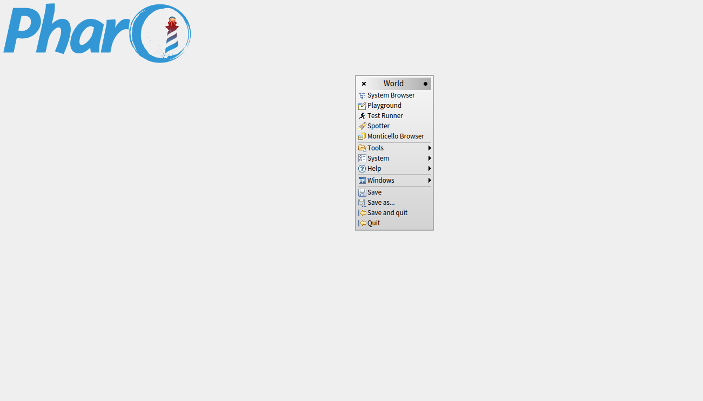

## Introduction
<a name=" Introduction"></a>
Some examples from this book are coming from the book of M\. Keeling & P\. Rohani ["Modeling Infectious Diseases in Humans and Animals"](http://press.princeton.edu/titles/8459.html)\.
There is a website with on\-line material for the book, where you can find the programs and the background of each program in C\+\+, FORTRAN and Matlab\.

Kendrick is a domain\-specific modelling language that provide tools in order to design, explore and visualize your epidemics models\. Kendrick is an embedded DSL and use the Pharo programming language as its host language\.

In order to use Kendrick, you need first to install the last version of Pharo in your computer\.


###1\. How to install Pharo
<a name="How to install Pharo"></a>Pharo is available as a free download from
[http://pharo\.org/download](http://pharo.org/download)\. Click the button for your
operating system to download the appropriate `.zip` file\. For example, the
full Pharo 4\.0 distribution for Mac OS X will be available at
[http://files\.pharo\.org/platform/Pharo4\.0\-mac\.zip](http://files.pharo.org/platform/Pharo4.0-mac.zip)\.

Once that file is unzipped, it will contain everything you need to run
Pharo \(this includes the VM, the image, and the sources, as explained below\)\.


###2\. Pharo components
<a name="Pharo components"></a>
Like many Smalltalk\-derived systems, Pharo currently consists of three main
components\. Although you do not need to deal with them directly for the purposes
of this book, it is important to understand the roles that they play\.

**1\.** The **image** is a current snapshot of a running Pharo system, frozen in
time\. It consists of two files: an *\.image* file, which contains the state of
all of the objects in the system \(including classes and methods, since they are
objects too\), and a *\.changes* file, which contains the log of all of the
changes to the source code of the system\. For Pharo 4\.0, these files are named
`Pharo4.0.image` and `Pharo4.0.changes`\. These files are portable across
operating systems, and can be copied and run on any appropriate virtual machine\.

**2\.** The **virtual machine** \(VM\) is the only part of the system that is
different for each operating system\. Pre\-compiled virtual machines are available
for all major computing environments\. \(For example, on Windows, the VM file is
named `Pharo.exe`\)\.

**3\.** The **sources** file contains the source code for all of the parts of
Pharo that don't change very frequently\. For Pharo 4\.0, this file is named
`PharoV40.sources`\.

As you work in Pharo, the *\.image* and *\.changes* files are modified \(so you
need to make sure that they are writable\)\. Always keep these two files together\.
Never edit them directly with a text editor, as Pharo uses them to store the
objects you work with and to log the changes you make to the source code\. It is
a good idea to keep a backup copy of the downloaded *\.image* and *\.changes*
files so you can always start from a fresh image and reload your code\.

The *\.sources* file and the VM can be read\-only, and can be shared between
different users\. All of these files can be placed in the same directory, but it
is also possible to put the Virtual Machine and sources file in separate
directory where everyone has access to them\. Do whatever works best for your
style of working and your operating system\.


###3\. Launching Pharo
<a name="Launching Pharo"></a>
To start Pharo, double click on the Pharo executable \(or, for more advanced
users, drag and drop the `.image` file onto the VM, or use the command line\)\.

On **Mac OS X**, double click the `Pharo4.0.app` bundle in the unzipped download\.

On **Linux**, double click \(or invoke from the command line\) the `pharo`
executable bash script from the unzipped Pharo folder\.

On **Windows**, enter the unzipped Pharo folder and double click `Pharo.exe`\.

In general, Pharo tries to "do the right thing"\. If you double click on the VM,
it looks for an image file in the default location\. If you double click on an
`.image` file, it tries to find the nearest VM to launch it with\.

Once you have multiple VMs \(or multiple images\) installed on your
machine, the operating system may no longer be able to guess the right one\. In this
case, it is safer to specify exactly which ones you meant to launch, either
by dragging and dropping the image file onto the VM, or specifying the image on
the command line \(see the next section\)\.


####3\.1\. Launching Pharo via the command line
<a name="Launching Pharo via the command line"></a>
The general pattern for launching Pharo from a terminal is:


```smalltalk
<Pharo executable> <path to Pharo image>
```


#####3\.1\.1\. Linux command line
<a name="Linux command line"></a>
For Linux, assuming that you're in the unzipped `pharo4.0` folder:


```smalltalk
./pharo shared/Pharo4.0.image
```


#####3\.1\.2\. Mac OS X command line
<a name="Mac OS X command line"></a>
For Mac OS X, assuming that you're in the directory with the unzipped
`Pharo4.0.app` bundle:


```smalltalk
Pharo4.0.app/Contents/MacOS/Pharo Pharo4.0.app/Contents/Resources/Pharo4.0.image
```


Incidentally, to drag\-and\-drop images on Mac OS in Finder, you need to
right\-click on `Pharo4.0.app` and select 'Show Package Contents'\.


#####3\.1\.3\. Windows command line
<a name="Windows command line"></a>
For Windows, assuming that you're in the unzipped `Pharo4.0` folder:


```smalltalk
Pharo.exe Pharo4.0.image
```


###4\. The World Menu
<a name="The World Menu"></a>
Once Pharo is running, you should see a single large window, possibly containing
some open workspace windows \(see Figure [4\.1](#worldMenu)\)\. You might notice a menu
bar, but Pharo mainly makes use of context\-dependent pop\-up menus\.

<a name="worldMenu"></a><figure></img><figcaption>Pharo 4.0 window with World Menu activated</figcaption></figure>

Clicking anywhere on the background of the Pharo window will display the
World Menu\. World Menu contains many of the Pharo tools, utilities and settings\.

You will see a list of several core tools in Pharo, including the class browser
and the workspace\.
