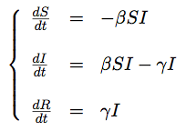
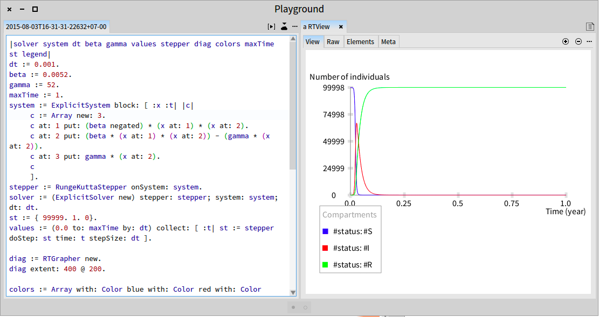
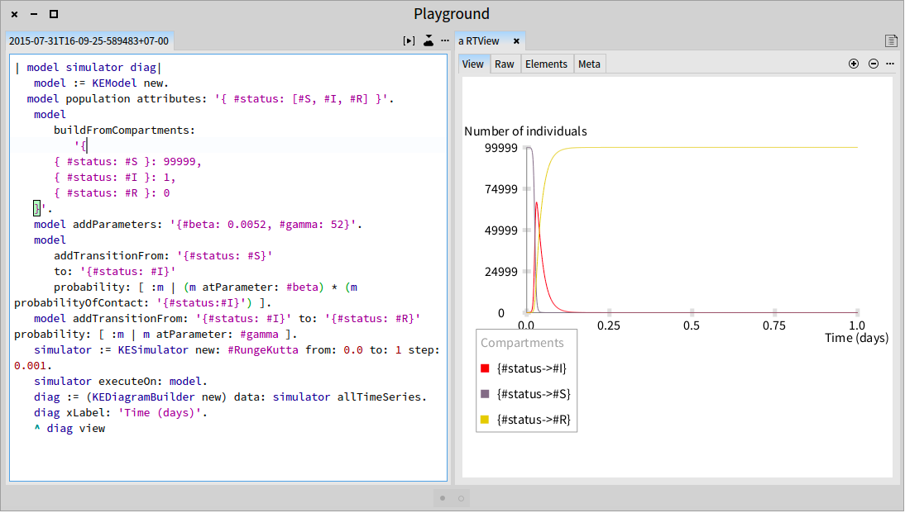

##Introduction to Simple Epidemic Model

The targeted model of the **Kendrick** language is compartmental model such as the SIR, SEIR model \.\.\. in which the individuals are first considered as *Susceptible* to pathogen \(status S\), then can be infected, assumed *Infectious* \(status I\) that can spread the infection and *Recovery* \(status R\) who are immunised and cannot become infected again\. The transition of status between compartments is represented mathematically as derivatives of compartment size with respect to time\.

At the moment, **Kendrick** supports for the mathematical models of epidemiology based on ordinary differential equations \(**ODEs**\)\. The system of ODEs followed represents the SIR classic model of epidemiology:

<a name="equation1"></a><figure></img><figcaption>Mathematical description of SIR model using ODEs</figcaption></figure>

These models are specified using the Kendrick language and modeled using the simulation module integrated into the platform\.
The simulator takes the Kendrick model \(the epidemiological model written in Kendrick language\) and performs a simulation algorithm and give out the result showing the spatial and temporal evolution dynamics of each compartment\. This visualization is done by using Roassal\.

The simulation module supports three modeling formalisms: deterministic, stochastic and individual\-based \(also called agent\-based\)\.
The modelers can switch between the simulation modes by indicating the algorithm used\. At the moment, we use the RK4 method for deterministically resolving ODEs\.
The stochastic simulation converts the ODEs of the model to events and using Gillespie's algorithms to generate stochastic model\.
The individual\-based simulator allows to reach the model at more detailed level\.


###1\.  Simple SIR \(without births and deaths\)

Program 2\.1 is a simple SIR model\. These are the equations and the code of the model:


####1\.1\.  Equations


####1\.2\.  Pharo code
Here, we just demonstrate the code written in Smalltalk language to resolve the system of equations and view the results\.


```smalltalk
|solver system dt beta gamma values stepper diag colors maxTime st legend|
dt := 0.001.
beta := 0.0052.
gamma := 52.
maxTime := 1.
system := ExplicitSystem block: [ :x :t| |c|
     c := Array new: 3.
     c at: 1 put: (beta negated) * (x at: 1) * (x at: 2).
     c at: 2 put: (beta * (x at: 1) * (x at: 2)) - (gamma * (x at: 2)).
     c at: 3 put: gamma * (x at: 2).
     c
     ].
stepper := RungeKuttaStepper onSystem: system.
solver := (ExplicitSolver new) stepper: stepper; system: system; dt: dt.
st := { 99999. 1. 0}.
values := (0.0 to: maxTime by: dt) collect: [ :t| st := stepper doStep: st time: t stepSize: dt ].

diag := RTGrapher new.
diag extent: 400 @ 200.

colors := Array with: Color blue with: Color red with: Color green.
1 to: 3 do: [ :i|
	|ds|
	ds := RTDataSet new.
	ds points: (1.0 to: ((maxTime/dt)+1) by: 1).
	ds y: [ :x| (values at: x) at: i ].
	ds x: [ :t| (t - 1)*dt].
	ds noDot.
	ds connectColor: (colors at: i).
	diag add: ds ].
diag axisX title: 'Time (year)'.
diag axisY title: 'Number of individuals'.
diag axisY noDecimal.
legend := RTLegendBuilder new.
legend view: diag view.
legend addText: 'Compartments'.
legend addColor: (colors at: 1) text: '#status: #S'.
legend addColor: (colors at: 2) text: '#status: #I'.
legend addColor: (colors at: 3) text: '#status: #R'.
legend build.
diag build.
diag view @ RTZoomableView.
^ diag view
```


Executing this script we obtain the results of the system of equations as in Figure [1\.1](#SIR_RK4_pharo)
<a name="SIR_RK4_pharo"></a>


####1\.3\.  Kendrick code

We use now the Kendrick DSL to express the SIR model\.
We start to create an instance of KEModel and then enumerate the compartment names with their initial value\.
In this model, we have 3 compartments S, I and R\. The population has one attribute *status*\.
There is at least one infected in order to start the process\.
Two transitions are added to the model, one from S to I and another one from I to R\.
The parameters of the model \.


```smalltalk
| model |
	model := KEModel new.
  model population attributes: '{ #status: [#S, #I, #R] }'.
	model
		buildFromCompartments:
			'{
		{ #status: #S }: 99999,
		{ #status: #I }: 1,
		{ #status: #R }: 0
	}'.
	model addParameters: '{#beta: 0.0052, #gamma: 52}'.
	model
		addTransitionFrom: '{#status: #S}'
		to: '{#status: #I}'
		probability: [ :m | (m atParameter: #beta) * (m probabilityOfContact: '{#status:#I}') ].
	model addTransitionFrom: '{#status: #I}' to: '{#status: #R}' probability: [ :m | m atParameter: #gamma ].
```


Paste this script in the Workspace tool, define the simulations on this model, we obtain the results as in Figure [1\.2](#SIR_RK4)\.
<a name="SIR_RK4"></a>


###2\.  SIR model with births and deaths


####2\.1\.  Equations


####2\.2\.  Pharo code


```smalltalk
|solver system dt beta gamma values stepper diag mu colors maxTime|
dt := 1.0.
mu := 1/(70*365.0).
beta := 520/365.0.
gamma := 1/7.0.
maxTime := 60*365.
system := ExplicitSystem block: [ :x :t| |c|
     c := Array new: 3.
     c at: 1 put: mu - (beta  * (x at: 1) * (x at: 2)) - (mu * (x at:1)).
     c at: 2 put: (beta * (x at: 1) * (x at: 2)) - (gamma * (x at: 2)) - (mu * (x at:2)).
     c at: 3 put: (gamma * (x at: 2)) - (mu * (x at: 2)).
     c
     ].

stepper := RungeKuttaStepper onSystem: system.
solver := (ExplicitSolver new) stepper: stepper; system: system; dt: dt.
state := { 0.1. 1e-4. 1-0.1-1e-4}.
values := (0.0 to: maxTime by: dt) collect: [ :t| |state| state := stepper doStep: state
                                                          time: t stepSize: dt ].
diag := OrderedCollection new.
colors := Array with: Color blue with: Color red with: Color green.
1 to: 3 do: [ :i|
    diag add:
        ((GETLineDiagram new)
            models: (1 to: maxTime+1 by: 1);
            y: [ :x| (values at: x) at: i ];
            color: (colors at: i))
     ].
builder := (GETDiagramBuilder new).
builder compositeDiagram
    xAxisLabel: 'Time in days';
    yAxisLabel: 'Number of Individuals';
    regularAxis;
    diagrams: diag.
builder open.
```


####2\.3\. Kendrick code

Comparing to the previous model, in this model, it should add four other transitions\. The first one represents the births of susceptible\.
The three others represent the deaths of each compartment\.
We use the ODE syntax to specify this model\.


```smalltalk
| model |
	model := KEModel new.
	model population attributes: '{#status: [#S, #I, #R]}'.
  model
		buildFromCompartments:
			'{
		{ #status: #S }: 4975,
		{ #status: #I }: 25,
		{ #status: #R }: 0
	}'.
	model addParameter: #beta value: 1 / 5000.
	model addParameter: #gamma value: 1 / 10.0.
	model addParameter: #mu value: 5e-4.
	model addParameter: #N value: #sizeOfPopulation.
	model addEquation: 'S:t=mu*N-beta*S*I-mu*S' parseAsAnEquation.
	model addEquation: 'I:t=beta*S*I-gamma*I-mu*I' parseAsAnEquation.
	model addEquation: 'R:t=gamma*I-mu*R' parseAsAnEquation.
```


###3\.  SEIR model with births and deaths
We introduce here a SEIR model\. The E status means that a susceptible becomes infected but not yet infectious\.


####3\.1\. Equations


####3\.2\. Kendrick code
Here, we use the parameters of measles model\. The time unit is day\.


```smalltalk
| model |
	model := KEModel new.
	model population attributes: '{#status: [#S, #E, #I, #R]}'.
	model
		buildFromCompartments:
			'{
		{#status: #S}: 99999,
		{#status: #I}: 1,
		{#status: #E}: 0,
		{#status: #R}: 0
	}'.
	model addParameters: '{
		#beta: 0.0000214,
		#gamma: 0.143,
		#mu: 0.0000351,
		#sigma: 0.125,
		#N: #sizeOfPopulation}'.
	model
		addTransitionFrom: '{#status: #S}'
		to: '{#status: #E}'
		probability: [ :m | (m atParameter: #beta) * (m probabilityOfContact: '{#status:#I}') ].
	model
		addTransitionFrom: '{#status: #E}'
		to: '{#status: #I}'
		probability: [ :m | m atParameter: #sigma ].
	model
		addTransitionFrom: '{#status: #I}'
		to: '{#status: #R}'
		probability: [ :m | m atParameter: #gamma ].
	model
		addTransitionFrom: '{#status: #S}'
		to: #empty
		probability: [ :m | m atParameter: #mu ].
	model
		addTransitionFrom: '{#status: #I}'
		to: #empty
		probability: [ :m | m atParameter: #mu ].
	model
		addTransitionFrom: '{#status: #R}'
		to: #empty
		probability: [ :m | m atParameter: #mu ].
	model
		addTransitionFrom: '{#status: #E}'
		to: #empty
		probability: [ :m | m atParameter: #mu ].
	model
		addTransitionFrom: #empty
		to: '{#status: #S}'
		probability: [ :m | m atParameter: #mu ].
```


###4\.  SEIR model with vaccination at births


####4\.1\.  Equations


####4\.2\.  Kendrick code


```smalltalk
| model |
	model := KEModel new.
	model population attributes: '{#status: [#S, #E, #I, #R]}'.
	model
		buildFromCompartments:
			'{
		{#status: #S}: 99999,
		{#status: #I}: 1,
		{#status: #E}: 0,
		{#status: #R}: 0
	}'.
	model addParameters: '{
		#beta: 0.00782,
		#gamma: 52.14,
		#mu: 0.0128,
		#sigma: 45.625,
		#N: #sizeOfPopulation,
		#p: 0.0}'.
	model
		addTransitionFrom: '{#status: #S}'
		to: '{#status: #E}'
		probability: [ :m | (m atParameter: #beta) * (m probabilityOfContact: '{#status:#I}') ].
	model
		addTransitionFrom: '{#status: #E}'
		to: '{#status: #I}'
		probability: [ :m | m atParameter: #sigma ].
	model
		addTransitionFrom: '{#status: #I}'
		to: '{#status: #R}'
		probability: [ :m | m atParameter: #gamma ].
	model
		addTransitionFrom: '{#status: #S}'
		to: #empty
		probability: [ :m | m atParameter: #mu ].
	model
		addTransitionFrom: '{#status: #I}'
		to: #empty
		probability: [ :m | m atParameter: #mu ].
	model
		addTransitionFrom: '{#status: #R}'
		to: #empty
		probability: [ :m | m atParameter: #mu ].
	model
		addTransitionFrom: '{#status: #E}'
		to: #empty
		probability: [ :m | m atParameter: #mu ].
	model
		addTransitionFrom: #empty
		to: '{#status: #S}'
		probability: [ :m | (m atParameter: #mu) * (1 - (m atParameter: #p)) ].
	model
		addTransitionFrom: #empty
		to: '{#status: #R}'
		probability: [ :m | (m atParameter: #mu) * (m atParameter: #p) ].
```


###5\.  SEIR model with seasonal forcing

The parameters of Kendrick model is not only a constant but also a temporal function as in this model\.


####5\.1\.  Equations


####5\.2\.  Kendrick code


```smalltalk
| model |
	model := KEModel new.
	model population attributes: '{ #status: [#S, #E, #I, #R] }'.
	model
		buildFromCompartments:
			'{
		{ #status: #S }: 99999,
		{ #status: #E }: 0,
		{ #status: #I }: 1,
		{ #status: #R }: 0
	}'.
	model addParameters: '{
		#beta0: 0.0052,
		#gamma: 52,
		#sigma: 52,
		#betaAmp: 0.3,
		#N: #sizeOfPopulation,
		#mu: 0.0125}'.
	model
		addParameter: #beta
		value: 'beta0*(1 + (betaAmp*cos(t)))' parseAsAnExpression.
	model
		addEquation: 'S:t=mu*N-beta*S*I-mu*S' parseAsAnEquation.
	model
		addEquation: 'E:t=beta*S*I-sigma*E-mu*E' parseAsAnEquation.
	model
		addEquation: 'I:t=sigma*E-gamma*I-mu*I' parseAsAnEquation.
	model
		addEquation: 'R:t=gamma*I-mu*R' parseAsAnEquation.
```


