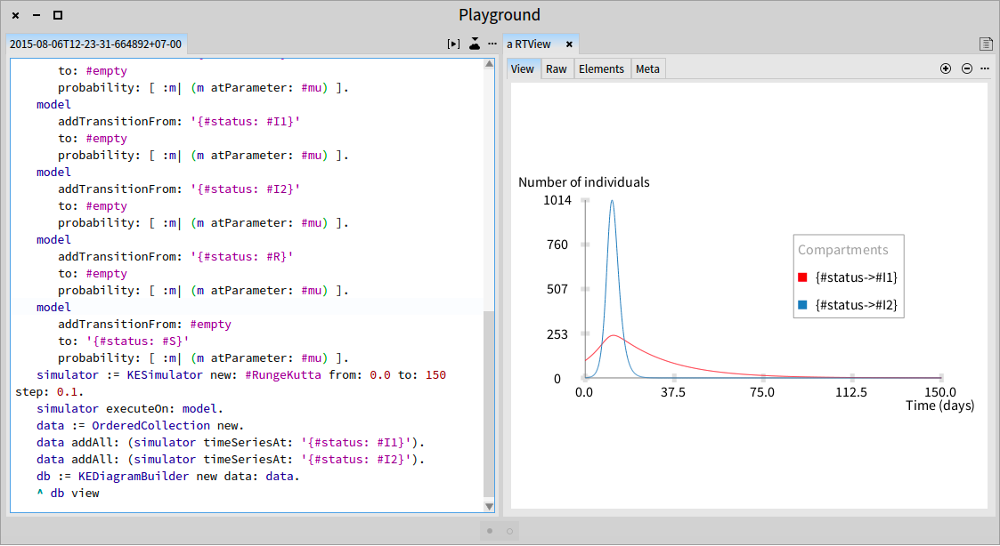
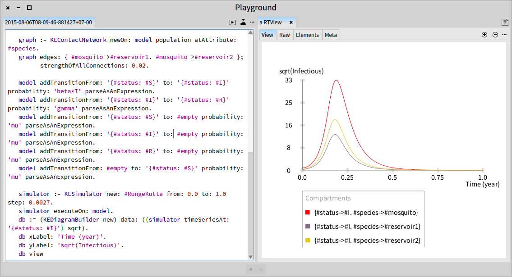

## Multi\-Pathogen/Multi\-Host Models
Here, we consider two concerns of epidemiology: multiple diseases or strains spreading through one host species and single disease that can be transmitted between different host species\.


###1\.  Simple SIR model with two strains
We deal with two co\-circulating strains within a simplified SIR framework\. These two strains are transmitted in the same population of susceptible\.
The system of equations represents this model is following:


```smalltalk
|model simulator db data|
	model := KEModel new.
	model population attributes: {#status->#(#S #I1 #I2 #R)}.
	model buildFromCompartments: '{
		{ #status: #S }: 9900,
		{ #status: #I1 }: 99,
		{ #status: #I2 }: 1,
		{ #status: #R }: 0
	}'.
	model addParameter: #beta1 value: 0.00002.
	model addParameter: #beta2 value: 0.00018.
	model addParameter: #gamma1 value: 0.1.
	model addParameter: #gamma2 value: 1.
	model addParameter: #mu value: 5e-5.

	model
		addTransitionFrom: '{#status:#S}'
		to: '{#status: #I1}'
		probability: [ :m| (m atParameter: #beta1) * (m probabilityOfContact: '{#status:#I1}') ].
	model
		addTransitionFrom: '{#status:#S}'
		to: '{#status:#I2}'
		probability: [ :m| (m atParameter: #beta2) * (m probabilityOfContact: '{#status: #I2}') ].
	model
		addTransitionFrom: '{#status: #I1}'
		to: '{#status: #R}'
		probability: [ :m| (m atParameter: #gamma1) ].
	model
		addTransitionFrom: '{#status: #I2}'
		to: '{#status: #R}'
		probability: [ :m| (m atParameter: #gamma2) ].
	model
		addTransitionFrom: '{#status: #S}'
		to: #empty
		probability: [ :m| (m atParameter: #mu) ].
	model
		addTransitionFrom: '{#status: #I1}'
		to: #empty
		probability: [ :m| (m atParameter: #mu) ].
	model
		addTransitionFrom: '{#status: #I2}'
		to: #empty
		probability: [ :m| (m atParameter: #mu) ].
	model
		addTransitionFrom: '{#status: #R}'
		to: #empty
		probability: [ :m| (m atParameter: #mu) ].
	model
		addTransitionFrom: #empty
		to: '{#status: #S}'
		probability: [ :m| (m atParameter: #mu) ].

	simulator := KESimulator new: #RungeKutta from: 0.0 to: 150 step: 0.1.
	simulator executeOn: model.
	data := OrderedCollection new.
	data addAll: (simulator timeSeriesAt: '{#status: #I1}').
	data addAll: (simulator timeSeriesAt: '{#status: #I2}').
	db := KEDiagramBuilder new data: data.
	db view
```


<a name="Multi_Strain_RK4"></a>


###2\.  SIR model with three species of hosts

In the standard models of epidemiology, the population is compartmentalized by only clinic status\.
As such, the population has only one degree of subdivision\.
In a context of multi\-host \(multi\-species\) model, the host population has two degrees of subdivision due to the attribute species of each individual\.


####2\.1\.  Equations


####2\.2\.  Configurations of Kendrick model

In epidemiology, it is important to distinguish between two basic assumptions in terms of the underlying structure of contacts within the population\.
Either the model is assumed to be mass action or pseudo mass action\.
The first kind reflects the situation where the number of contacts is independent of the population size\.
So that the force of infection \.
In some circumstances, the transmission rate  is rescaled by \.
The second one assumes that as the population size increases, so does the contact rate\.
As such the force of infection \.

At the moment, Kendrick model includes three parameters of configuration: sizeOfPopulation, rescale, mass\_action\.
By default:


```smalltalk
#sizeOfPopulation->#population
#rescale->true
#mass_action->true
```


In the context of the multi\-species model, it is important to config the size of population for each species\.
As such:


```smalltalk
model configurations: {#sizeOfPopulation->#(#species)}
```


####2\.3\.  Kendrick model

In this model, we define the parameter  for three scopes corresponding to each species\.
In order to represent the interaction between three species, we define a contact network\.
Due to this network, the force of infection will be modified as:

where  denotes the strength of connection between species  and \.


```smalltalk
| model graph |
	model := KEModel new.
	model
		population:
			(KEMetaPopulation new
				attributes:
					{(#status -> #(#S #I #R)).
					(#species -> #(#mosquito #reservoir1 #reservoir2))}).
	model
		buildFromAttributes: #(#status #species)
		compartments:
			{(#(#S #mosquito) -> 9800).
			(#(#I #mosquito) -> 200).
			(#(#R #mosquito) -> 0).
			(#(#S #reservoir1) -> 1000).
			(#(#I #reservoir1) -> 0).
			(#(#R #reservoir1) -> 0).
			(#(#S #reservoir2) -> 2000).
			(#(#I #reservoir2) -> 0).
			(#(#R #reservoir2) -> 0)}.
	model addParameter: #mu
		   inScopes: {
				#species->#mosquito.
				#species->#reservoir1.
				#species->#reservoir2}
		   values: #(12.17 0.05 0.05).
	model addParameter: #gamma value: 52.
	model addParameter: #beta value: 1.
	model addParameter: #N value: #sizeOfPopulation.
	model configurations: { #sizeOfPopulation->#(#species) }.

	graph := KEContactNetwork
			newOn: model population
			atAttribute: #species.
	graph edges: { #mosquito->#reservoir1. #mosquito->#reservoir2 };
			strengthOfAllConnections: 0.02.
	model
		addTransitionFrom: '{#status: #S}'
		to: '{#status: #I}'
		probability: [ :m | (m atParameter: #beta) * (m probabilityOfContact: '{#status: #I}') ].
	model
		addTransitionFrom: '{#status: #I}'
		to: '{#status: #R}'
		probability: [ :m | m atParameter: #gamma ].
	model
		addTransitionFrom: '{#status: #S}'
		to: #empty
		probability: [ :m | m atParameter: #mu ].
	model
		addTransitionFrom: '{#status: #I}'
		to: #empty
		probability: [ :m | m atParameter: #mu ].
	model
		addTransitionFrom: '{#status: #R}'
		to: #empty
		probability: [ :m | m atParameter: #mu ].
	model
		addTransitionFrom: #empty
		to: '{#status: #S}'
		probability: [ :m | m atParameter: #mu ].
```


<a name="Multi_Host_RK4"></a>

[Stochastic dynamics of three hosts species using Gillespie's direct](file://figures/Multi_Host_Gil)

[Stochastic dynamics of three hosts species using agent\-based approach](file://figures/Multi_Host_IBM)
